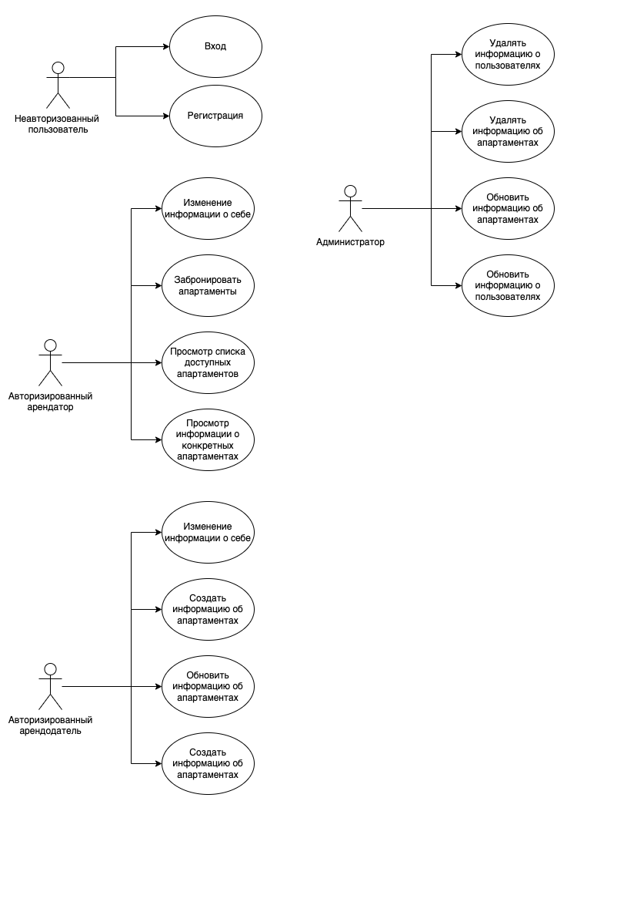
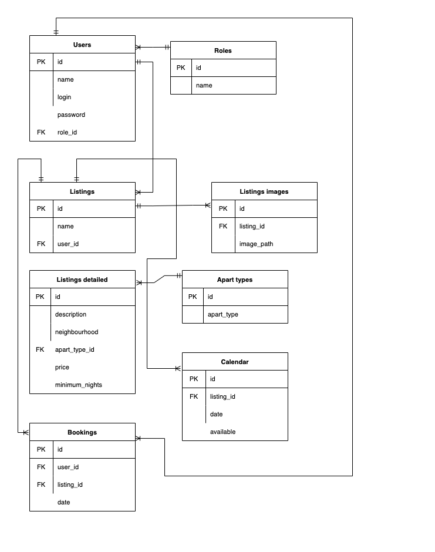
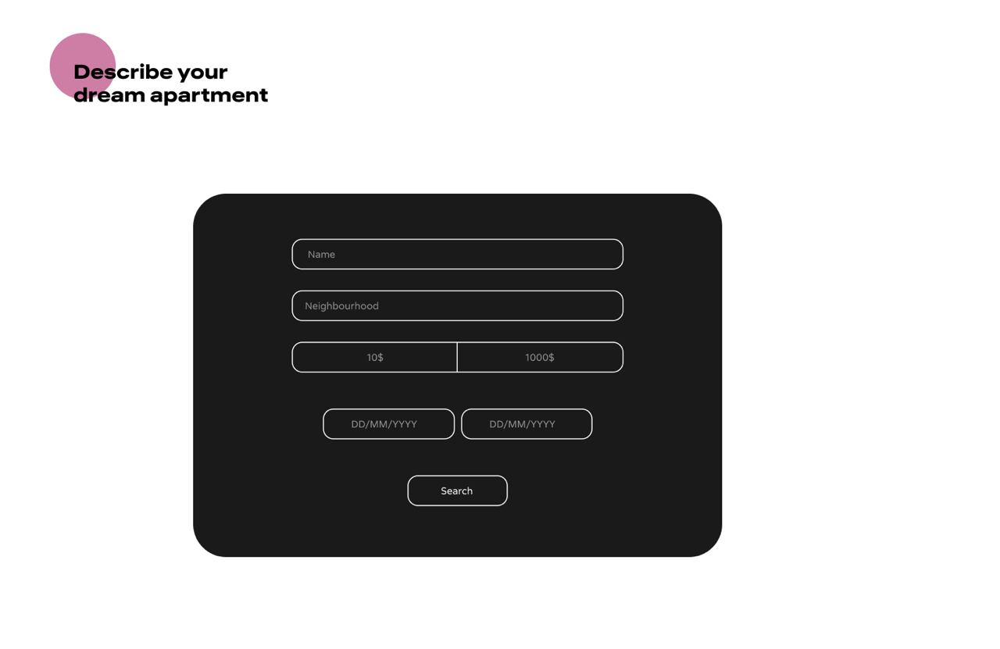
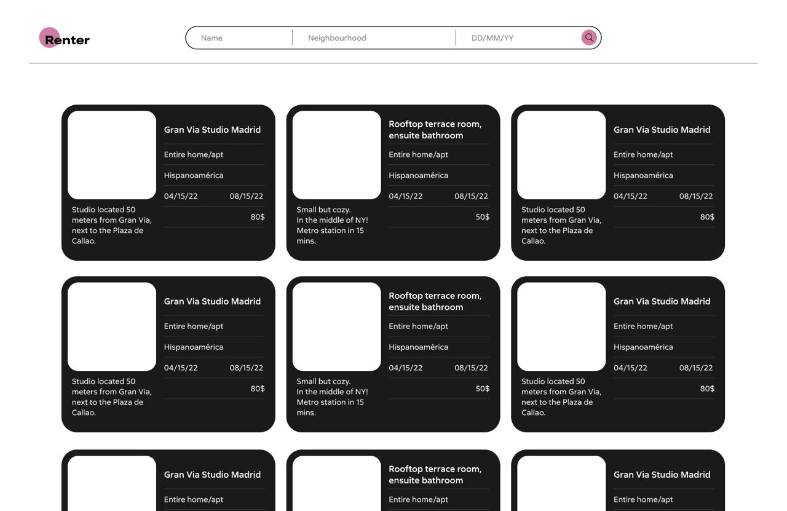
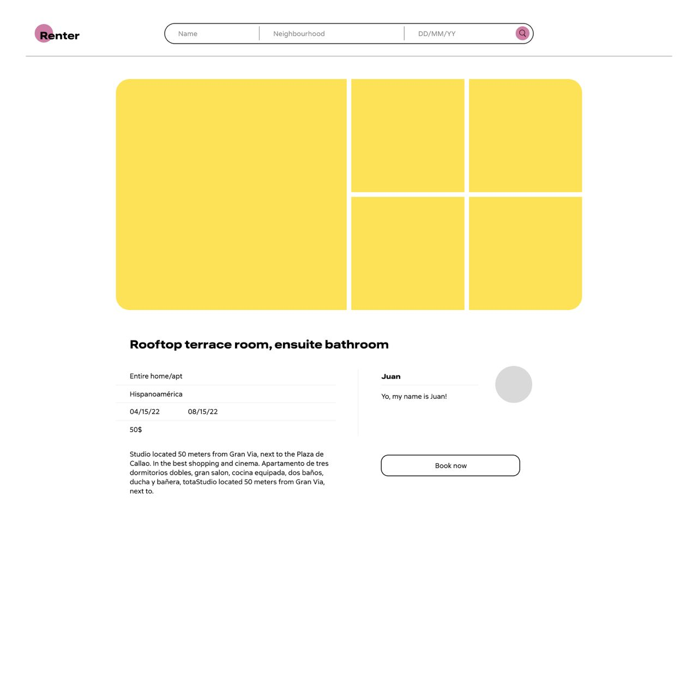

# Сервис для поиска и аренды жилья 

### 1. Use-Case



### 2. ER-диаграмма



### 3. Функциональные требования

1. Посетитель сайта может зарегистрироваться или зайти в систему.
2. Авторизированный арендатор может просматривать объявления и информацию о них, выложенные арендодателем, а также забранировать апартаменты, может изменить персональную информацию о себе.
3. Авторизированный арендодатель может создавать, удалять и обновлять объявления о предоставляемых апартаментах, может изменить персональную информацию о себе.
4. Администраторы сервиса могут удалять и модифицировать информацию о доступных апартаментах и пользователях.

### 4. Экраны будущего приложения









### 5. Apache Benchmark Log

```
This is ApacheBench, Version 2.3 <$Revision: 1879490 $>
Copyright 1996 Adam Twiss, Zeus Technology Ltd, http://www.zeustech.net/
Licensed to The Apache Software Foundation, http://www.apache.org/

Benchmarking 127.0.0.1 (be patient)


Server Software:        nginx/1.23.2
Server Hostname:        127.0.0.1
Server Port:            81

Document Path:          /api/v1/listing_detailed?price=140&listing_id=34677096
Document Length:        94 bytes

Concurrency Level:      50
Time taken for tests:   12.670 seconds
Complete requests:      10000
Failed requests:        0
Non-2xx responses:      10000
Total transferred:      3330000 bytes
HTML transferred:       940000 bytes
Requests per second:    789.26 [#/sec] (mean)
Time per request:       63.350 [ms] (mean)
Time per request:       1.267 [ms] (mean, across all concurrent requests)
Transfer rate:          256.66 [Kbytes/sec] received

Connection Times (ms)
              min  mean[+/-sd] median   max
Connect:        0    1   1.0      0      27
Processing:     9   62  30.6     57     273
Waiting:        9   61  30.1     55     272
Total:         10   63  30.6     57     276

Percentage of the requests served within a certain time (ms)
  50%     57
  66%     69
  75%     77
  80%     83
  90%    101
  95%    120
  98%    148
  99%    170
 100%    276 (longest request)

```